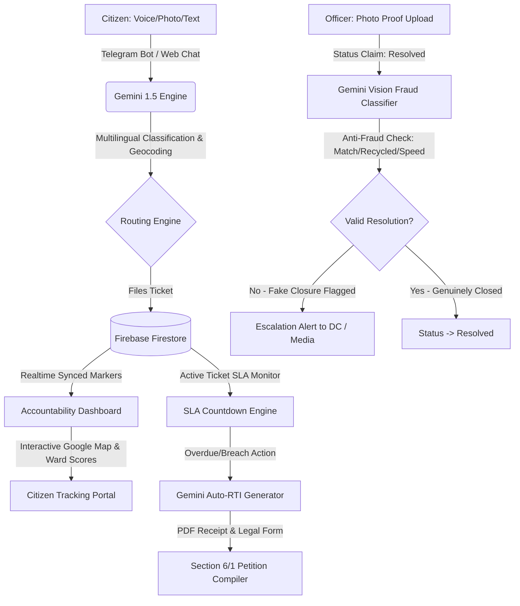
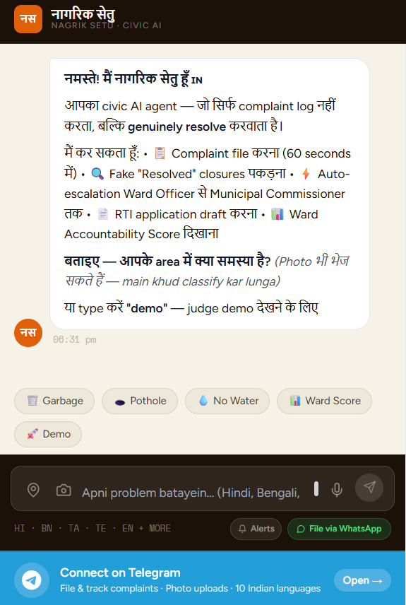
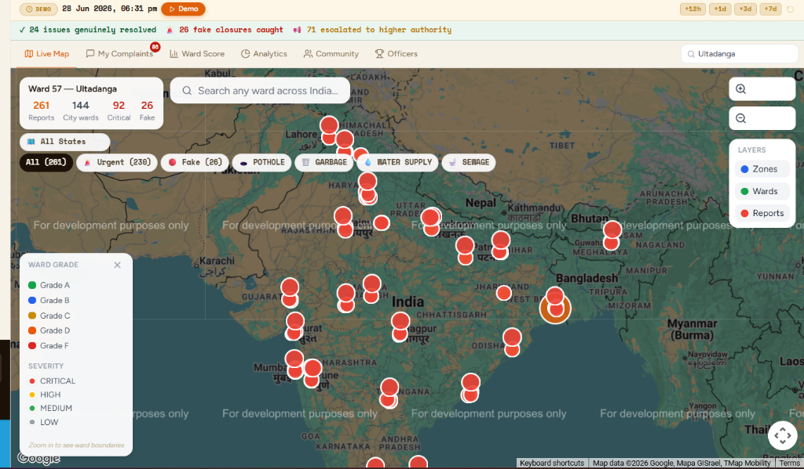
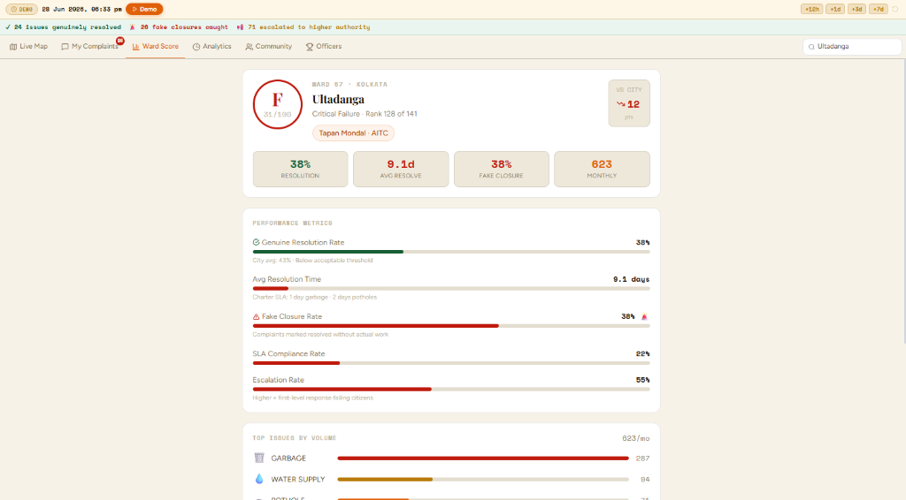
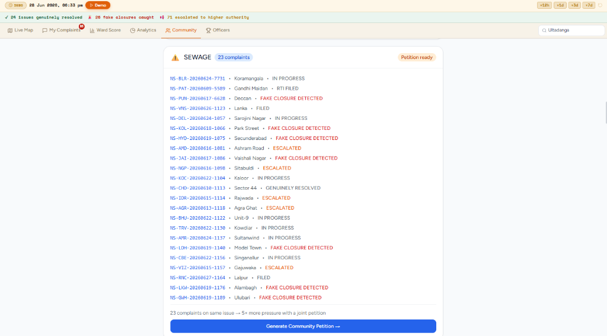
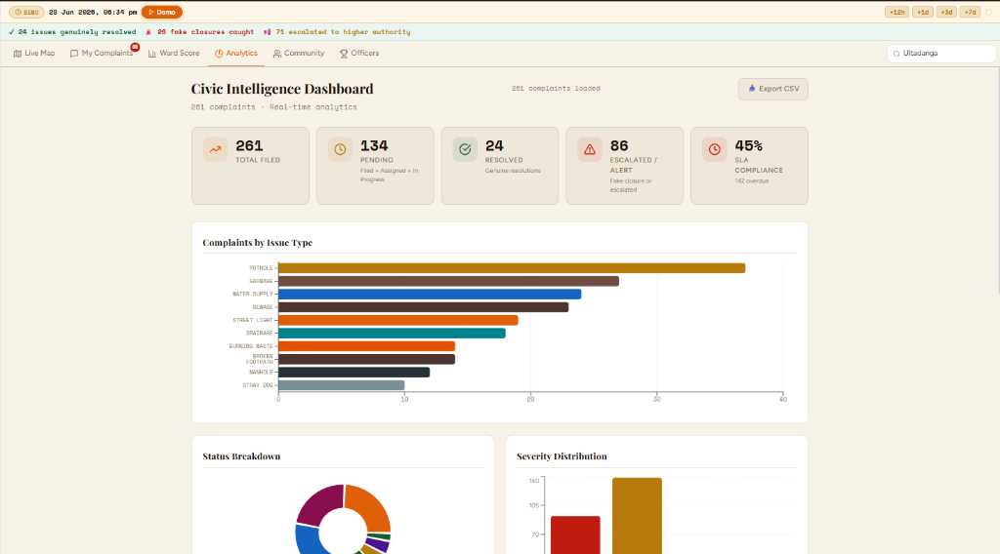
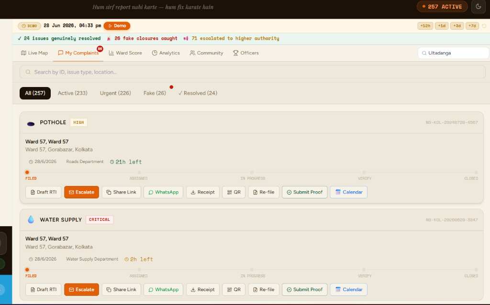
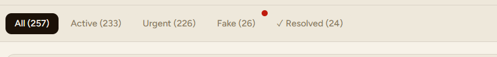

# 🇮🇳 नागरिक सेतु | Nagrik Setu
## Hyperlocal Autonomous Civic Grievance & Accountability AI Agent
> **"Hum sirf report nahi karte — hum fix karate hain."** *(We don't just report — we enforce resolution.)*

[](#)
[](#)
[](#)
[](#)

---

## 🏛️ Executive Summary

**Nagrik Setu** is a decentralized, multimodal civic agent and accountability system designed to bridge the trust gap between Indian citizens and municipal authorities. 

While existing public portals (like CPGRAMS, Swachhata, or Sahaaya) act as passive, one-way filing boxes, Nagrik Setu is an **active agent**. It manages the entire lifecycle of a complaint: from natural language voice/photo filing, geofenced routing, and real-time SLA countdowns, to detecting fake officer closures using visual analysis, drafting automated escalation emails, and compiling legally compliant **Right-To-Information (RTI) petitions** when deadlines are breached.

---

## 🔄 Core Architecture & Workflow



---

## 📷 Application Showcase / Screenshots

### 💬 Conversational Multilingual Welcome (Hindi / Hinglish / Bengali)
The web assistant welcomes citizens in their native tongue and lists core capabilities (Complaint filing, Anti-fraud checks, auto-RTI compilation, and Ward Scorecards).


### 🗺️ Live Geographic Hot-Spots & Ward Map
An interactive Google Maps dashboard plotting active geofenced ward borders, complaint markers, heatmaps, and local municipal resolution percentages.


### 📊 Hyperlocal Ward Accountability Card
Detailed performance scorecard grading wards based on real-time resolution speed, SLA compliance rates, and fraud/fake closure percentages. Shown below is Ward 57 (Kolkata) with a failing Grade F.


### 👥 Hyperlocal Community Petitions
Clustered grievance aggregation. Nagrik Setu dynamically groups multiple reports (e.g. 23 sewage complaints in a ward) to generate a joint community petition, multiplying civil pressure.


### 📈 Civic Intelligence Analytics
Real-time administrative data visualization displaying total filed complaints, pending tasks, resolution rates, SLA compliance compliance levels, and severity distributions.


### 🖥️ Multilingual Citizen Chat & Real-Time Dashboard
The web portal acts as a dual-pane command center. On the left is the conversational citizen assistant interface; on the right is the active municipal tracking console.


### 📲 Automated Conversational Filing (Telegram bot)
Citizens file complaints in seconds by dropping images and voice notes directly into Telegram. Gemini extracts coordinates, ward names, and issues instantly.


### 🔍 Search & Active Complaint Tracking
Locate logged issues instantly, inspect remaining SLA hours, submit citizen proof, and draft legally binding RTI documents with a single click.


---

## 🌟 Key Pillars & Features

### 🎙️ 1. Multimodal Grievance Ingest (22+ Indian Languages)
* **Visual Classification:** Gemini automatically analyzes citizen-submitted photos (e.g. garbage piles, road potholes, broken water lines), categorizes them into municipal departments, extracts severity, and assigns the correct priority.
* **Conversational AI:** Native voice dictation and translation support for **22 official Indian languages** (Hindi, Bengali, Tamil, Telugu, Marathi, Kannada, Malayalam, Gujarati, Punjabi, Hinglish, and English).

### ⏳ 2. Dynamic SLA Countdown & Warning Engine
* Implements color-coded, live SLA monitoring:
  * 🟢 **Green:** Safe timeline (> 6 hours remaining).
  * 🟡 **Amber:** Critical timeline warning (2 - 6 hours remaining).
  * 🔴 **Red:** Breach imminent (< 2 hours remaining) or **Overdue** status showing exact elapsed time.
* Standardized SLAs: `6 hours` for high-severity hazards (e.g. fallen power wires), `24 hours` for water leaks and sewage, and `48 hours` for solid waste.

### 🛡️ 3. Computer Vision Anti-Fraud Verification
* **Officer Audit Verification:** When a municipal officer uploads a resolution photo to close a complaint, the Gemini Vision API compares the original complaint photo against the resolution photo.
* **Fraud Probability Heuristics:** Calculates a fraud score out of 100 based on three indicators:
  1. **Speed Penalty (35 pts):** Ticket closed in under 1 hour (unrealistic for physical labor).
  2. **No-Photo Penalty (28 pts):** Resolution marked without uploading field proof.
  3. **Pattern Penalty (30 pts):** Officer has a historical pattern of marking multiple claims resolved simultaneously at the end of shifts.

### 📄 4. Automatic Section 6(1) RTI Petition Compiler
* In the event of an SLA breach, the agent auto-drafts a legally formatted **Right-to-Information (RTI) Petition** citing:
  * State-specific municipal codes (KMC Act 1980, BMC Act 1888, DMC Act 1957).
  * **Section 6(1) of the Central RTI Act 2005**.
  * Specific questions demanding public officer inspection times, budget allocations, and names of contractors.
* Compiles it directly into a downloadable, print-ready PDF stamped with a verification QR code for citizen signature.

### 📊 5. Hyperlocal Ward Scorecards
* City-wide accountability leaderboard ranking municipal wards (A to F grades) based on real-time resolution speed, SLA compliance rates, and fake closure index flags.

---

## 🌴 Project Directory Tree

```
nagrik-setu/
├── app/
│   ├── api/
│   │   ├── chat/route.ts        # Gemini AI conversational streaming endpoint
│   │   ├── gmail/route.ts       # Gmail API automated escalation dispatch
│   │   ├── sheets/route.ts      # Google Sheets API ward data export handler
│   │   └── telegram/route.ts    # Telegram Bot webhook processor
│   ├── dashboard/
│   │   └── page.tsx             # Interactive dual-panel analytics command center
│   ├── favicon.ico
│   ├── globals.css              # Custom styling definitions & micro-animations
│   ├── layout.tsx               # Root viewport layout & Google Maps loader
│   └── page.tsx                 # High-converting landing & simulator welcome page
├── components/
│   ├── ActiveComplaints.tsx     # Active ticket tracking list & SLA countdowns
│   ├── ChatInterface.tsx        # WhatsApp-style multilingual chat client
│   ├── CivicMap.tsx             # Geofenced Google Maps & active cluster plots
│   ├── Header.tsx               # Global dashboard header with dynamic active indicator
│   └── RTIDocument.tsx          # Dynamic Right-to-Information PDF compiler display
├── lib/
│   ├── demoData.ts              # Large-scale mock datasets across 8 major metros
│   ├── firebase.ts              # Firebase Client SDK & Firestore save utilities
│   ├── pdfReceipt.ts            # jsPDF client-side complaint PDF compiler
│   └── types.ts                 # Type definitions & TypeScript interfaces
├── public/
│   ├── screenshots/             # Embedded README visual assets
│   ├── icons/                   # System favicon assets
│   └── manifest.json            # PWA manifest
├── Dockerfile                   # Multi-stage production container build script
├── next.config.js               # Next.js standalone export configuration
├── package.json                 # Node dependencies
├── tailwind.config.js           # Styling customization guidelines
└── tsconfig.json                # TS compiler parameters
```

---

## 🛠️ Technical Stack & Architectural Decisions (Why We Used It)

To build a production-grade, highly resilient civic accountability system, the technology stack was carefully selected based on scalability, developer speed, and AI capabilities:

| Technology | Role | Why We Used It / Core Rationale |
| :--- | :--- | :--- |
| **Next.js 14 (App Router)** | Core Web Framework | Chosen for **Server-Side Rendering (SSR)** for fast landing page loads, hybrid serverless API routing (`/api`), and **React Server Components (RSC)** to protect server-side environment credentials like Google Client Secrets. |
| **Gemini 1.5 Flash** | Core AI Reasoning Engine | Selected for its **industry-leading speed, cheap token costs**, and **multimodal visual context window**. Perfect for real-time categorizations of photos and visual fraud comparison audits of officer proof. |
| **Google Maps API** | Spatial Visualization | The default standard for geocoding and GIS. Enabled rendering of geofenced municipal ward boundaries, custom severity marker icons, and coordinates clustering of similar local complaints. |
| **Firebase Firestore** | Real-time Database | Chosen for **real-time query listener support (`onSnapshot`)**. This allows any complaint filed on the Telegram Bot to immediately trigger updates on the open Maps dashboard without browser reloading. |
| **Gmail API (OAuth)** | Legal Escalation Pipeline | Used to send automated legal notifications to municipal commissioners and councillors. Supports full token security and professional formatting to ensure delivery. |
| **Google Sheets API** | Open-Data Export | Allows community leaders to export local ward scores and complaint listings to Google Sheets with one click to share with local neighborhood associations. |
| **jsPDF & QRCode** | Client-Side Compilation | Compiles compliant Right-to-Information (RTI) petitions directly in the user's browser, eliminating server-side rendering loads and ensuring instant downloads. |
| **GCP Cloud Run** | Serverless Hosting | Deploys containerized code inside a secure Docker runtime. Supports **scale-to-zero** configuration which eliminates hosting costs during periods of inactivity. |

---

## ⚙️ Environment Configuration

Create a `.env.local` file in the root directory:

```env
# Google Developer APIs
GEMINI_API_KEY=your_gemini_api_key
NEXT_PUBLIC_GOOGLE_MAPS_API_KEY=your_google_maps_key

# Firebase SDK Credentials
NEXT_PUBLIC_FIREBASE_API_KEY=your_firebase_api_key
NEXT_PUBLIC_FIREBASE_AUTH_DOMAIN=your_project.firebaseapp.com
NEXT_PUBLIC_FIREBASE_PROJECT_ID=your_project_id
NEXT_PUBLIC_FIREBASE_STORAGE_BUCKET=your_project.appspot.com
NEXT_PUBLIC_FIREBASE_MESSAGING_SENDER_ID=your_messaging_sender_id
NEXT_PUBLIC_FIREBASE_APP_ID=your_app_id

# Telegram Webhook Integration
TELEGRAM_BOT_TOKEN=your_telegram_bot_token

# Google OAuth (Gmail & Sheets API integration)
GOOGLE_CLIENT_ID=your_google_oauth_client_id
GOOGLE_CLIENT_SECRET=your_google_oauth_client_secret
GOOGLE_REFRESH_TOKEN=your_google_oauth_refresh_token
```

---

## 🚀 Setup & Installation Guide

### Local Development Setup
1. **Clone the repository & enter workspace:**
   ```bash
   git clone https://github.com/Prasunnandi/Nagrik_setu_v1.git
   cd Nagrik_setu_v1
   ```
2. **Install node dependencies:**
   ```bash
   npm install
   ```
3. **Run local developer server:**
   ```bash
   npm run dev
   ```
4. **Trigger Judge Demo Mode:** 
   Open `http://localhost:3000` and type **`demo`** in the chatbot to trigger the interactive 5-step simulation highlighting complaint filing, SLA warnings, fake closures, RTI compilation, and ward dashboard ranking.

### Containerized Deployment (GCP Cloud Run)
The codebase includes a production-ready multi-stage `Dockerfile`. Build and run it on Cloud Run:
```bash
gcloud run deploy nagrik-setu \
  --source . \
  --region asia-south1 \
  --allow-unauthenticated
```

---

## 🔮 Future Roadmap & Upcoming Integrations

To further scale **Nagrik Setu** as a next-generation decentralized civic OS, we plan to implement the following Google Cloud and developer integrations:

### 🤖 1. Gemini Vision Auto-Validation of Officer Proof
* **The Concept:** When a municipal officer uploads a "resolution photo" to close a ticket, the system automatically triggers a **Google Cloud Function** using **Gemini 1.5 Flash**.
* **How it works:** Gemini compares the original citizen photo (e.g. a pothole) with the officer's resolution photo (e.g. paved road). If the photos don't match or look like fake internet downloads, the AI rejects the closure, flags a **Fake Closure**, and alerts the ward supervisor.

### 📞 2. Vertex AI Text-to-Speech (TTS) Automated Call Alerts
* **The Concept:** If a critical complaint (like a major water pipe burst) is ignored past its SLA, the system escalates the issue by making an actual phone call to the ward engineer.
* **How it works:** It uses **Vertex AI TTS** to synthesize a custom voice message in the officer's local language (e.g. Bengali/Hindi/English) and calls them via **Twilio** to demand immediate action.

### 📊 3. GCP BigQuery & Looker Predictive Analytics for Ward Scores
* **The Concept:** A predictive dashboard for city planning and budget allocations.
* **How it works:** Stream all complaints into **Google BigQuery** in real-time. Use **AutoML** to predict which wards are likely to experience severe infrastructure failures (e.g. flooding or electricity issues) next month based on weather trends and historical complaint volume.

### 📢 4. Auto-Routed WhatsApp Broadcasts to Ward Residents
* **The Concept:** Proactive citizen communication and transparency.
* **How it works:** If a major water line is shut down in Ward 57 for repairs, the system uses the **Geofence data in Firestore** to automatically broadcast a WhatsApp alert to all registered residents of Ward 57, keeping them informed of scheduled repair times.

---

## 🏛️ Supported Municipal Helplines

| Metro City | Local Municipal Body | Official Helpline |
| :--- | :--- | :--- |
| **Mumbai** | Municipal Corporation of Greater Mumbai (MCGM) | `1916` |
| **Delhi** | Municipal Corporation of Delhi (MCD) | `155305` |
| **Bengaluru** | Bruhat Bengaluru Mahanagara Palike (BBMP) | `1533` |
| **Kolkata** | Kolkata Municipal Corporation (KMC) | `1800-103-0012` |
| **Chennai** | Greater Chennai Corporation (GCC) | `1913` |
| **Hyderabad** | Greater Hyderabad Municipal Corporation (GHMC) | `040-21111111` |

---

## 👤 Developer Profile

**Prasun Nandi**  
*B.Tech in Computer Science & Business Systems* (Techno India University, 2022–2026)  
*AI-ML Intern at Google for Developers & EduSkills*  

* **LinkedIn:** [prasunnandi-16](https://www.linkedin.com/in/prasunnandi-16-/)
* **GitHub:** [Prasunnandi](https://github.com/Prasunnandi)
* **Email:** [prasunnandi18@gmail.com](mailto:prasunnandi18@gmail.com)

---
*Nagrik Setu — Empowering Citizens with Autonomous AI. 🇮🇳*
